# Kafka-Lib API Documentation

This document describes the functions available in the Kafka-Lib library with detailed parameters, return values, and sequence diagrams.

## 1. Broker Pool Functions

### `new(cfg: Arc<KafkaConfig>, idle_time: Duration, client_id: &'static str) -> BrokerPool`

**Description**: Creates a new brokers pool using configuration and idle time. Idle time is used to free connection resources if it was not used for specified duration.

**Parameters**:

- `cfg`: Arc\<KafkaConfig> - Kafka connection configuration
- `idle_time`: Duration - Duration after which idle connections are closed
- `client_id`: &'static str - Client identifier string

**Returns**: `BrokerPool` - A new instance of BrokerPool

**Sequence Diagram**:

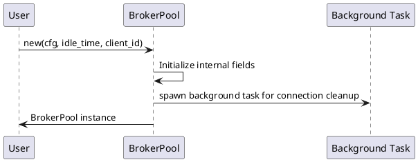

### `init(&mut self) -> Result<()>`

**Description**: Initializes the broker pool by connecting to bootstrap servers, loading API versions, and metadata.

**Parameters**: None (self reference)

**Returns**: `Result<()>` - Success or error

**Sequence Diagram**:

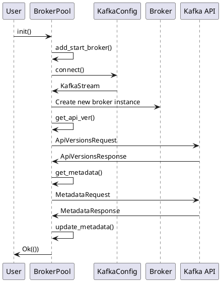

### `produce<T: AsRef<str>>(&mut self, topic: T, key: T, payload: T, headers: &HashMap<String, String>, create_timestamp: bool) -> Result<(ResponseHeader, ProduceResponse)>`

**Description**: Sends a message to a Kafka topic.

**Parameters**:

- `topic`: T - Topic name (where T: AsRef\<str>)
- `key`: T - Message key (where T: AsRef\<str>)
- `payload`: T - Message payload (where T: AsRef\<str>)
- `headers`: &HashMap\<String, String> - Message headers
- `create_timestamp`: bool - Whether to create a timestamp

**Returns**: `Result\<(ResponseHeader, ProduceResponse)>` - Response header and produce response

**Sequence Diagram**:

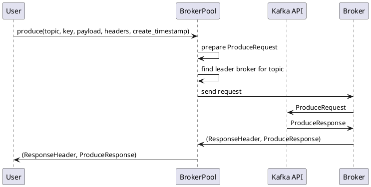

### `fetch_from_topics<T: AsRef<str>, I: Into<i8>>(&mut self, topic: &[T], timeout_ms: i32, isolation_level: I, session_id: i32, fetch_offset: i64) -> Result<(ResponseHeader, FetchResponse)>`

**Description**: Fetches messages from given topics using specified offset and isolation level.

**Parameters**:

- `topic`: &[T] - Array of topic names (where T: AsRef\<str>)
- `timeout_ms`: i32 - Maximum time to wait for data
- `isolation_level`: I - Isolation level (where I: Into\<i8>)
- `session_id`: i32 - Session identifier
- `fetch_offset`: i64 - Offset to fetch from

**Returns**: `Result<(ResponseHeader, FetchResponse)>` - Response header and fetch response

**Sequence Diagram**:

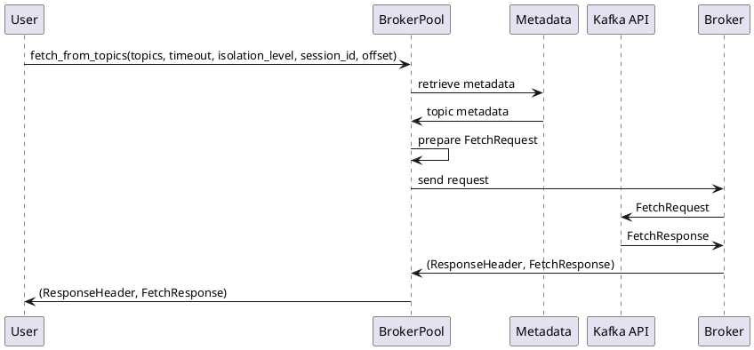

### `create_topic<T: AsRef<str>>(&mut self, name: T, partition_count: i32, replica_count: i16, configs: &[(T, T)]) -> Result<(ResponseHeader, CreateTopicsResponse)>`

**Description**: Creates a new Kafka topic with specified parameters.

**Parameters**:

- `name`: T - Topic name (where T: AsRef\<str>)
- `partition_count`: i32 - Number of partitions
- `replica_count`: i16 - Number of replicas
- `configs`: &[(T, T)] - Configuration key-value pairs

**Returns**: `Result<(ResponseHeader, CreateTopicsResponse)>` - Response header and create topics response

**Sequence Diagram**:

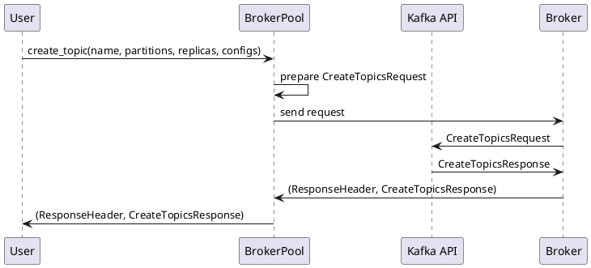

### `delete_topic<T: AsRef<str>>(&mut self, topic: T) -> Result\<(ResponseHeader, DeleteTopicsResponse)>`

**Description**: Deletes a Kafka topic.

**Parameters**:

- `topic`: T - Topic name (where T: AsRef\<str>)

**Returns**: `Result<(ResponseHeader, DeleteTopicsResponse)>` - Response header and delete topics response

**Sequence Diagram**:

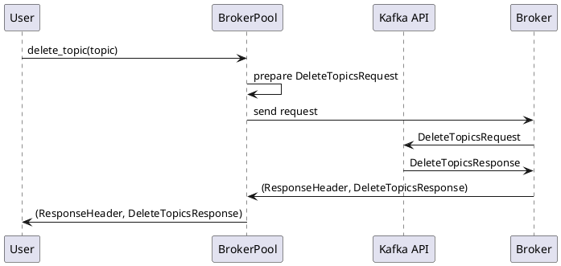

### `list_offsets<T: AsRef<str>, I: Into<i8>>(&mut self, topic: T, partition: i32, isolation_level: I, timestamp: KafkaListOffsets) -> Result<(ResponseHeader, ListOffsetsResponse)>`

**Description**: Gets offset for a topic and partition using isolation level and timestamp.

**Parameters**:

- `topic`: T - Topic name (where T: AsRef\<str>)
- `partition`: i32 - Partition number
- `isolation_level`: I - Isolation level (where I: Into\<i8>)
- `timestamp`: KafkaListOffsets - Timestamp for offset lookup

**Returns**: `Result<(ResponseHeader, ListOffsetsResponse)>` - Response header and list offsets response

**Sequence Diagram**:

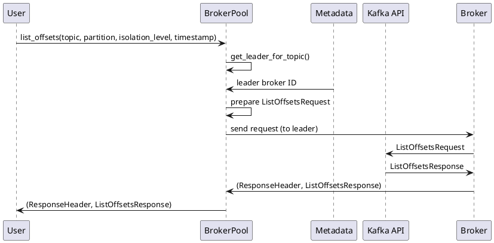

### `get_watermarks<T: AsRef<str>>(&mut self, topic: T, partition: i32, isolation_level: KafkaIsolationLevel) -> Result<(i64, i64)>`

**Description**: Retrieves start and end offset (watermarks) for a given topic and partition.

**Parameters**:

- `topic`: T - Topic name (where T: AsRef\<str>)
- `partition`: i32 - Partition number
- `isolation_level`: KafkaIsolationLevel - Isolation level for the request

**Returns**: `Result<(i64, i64)>` - Tuple with (start offset, end offset)

**Sequence Diagram**:

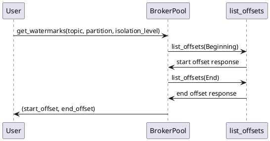

### `offset_fetch<T: AsRef<str>>(&mut self, group_id: T, topic: T, partitions: &[i32]) -> Result<(ResponseHeader, OffsetFetchResponse)>`

**Description**: Fetches offsets for consumer group and topic partitions.

**Parameters**:

- `group_id`: T - Consumer group ID (where T: AsRef\<str>)
- `topic`: T - Topic name (where T: AsRef\<str>)
- `partitions`: &[i32] - List of partition IDs

**Returns**: `Result<(ResponseHeader, OffsetFetchResponse)>` - Response header and offset fetch response

**Sequence Diagram**:

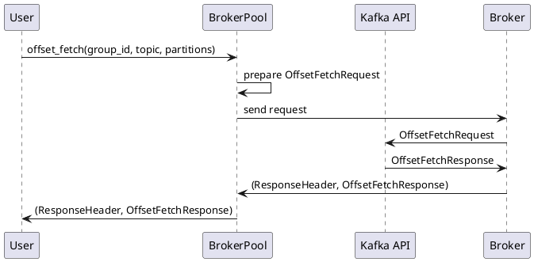

### `describe_acl(&mut self, rq: DescribeAclsRequest) -> Result<(ResponseHeader, DescribeAclsResponse)>`

**Description**: Gets ACLs from Kafka broker using filter data in request.

**Parameters**:

- `rq`: DescribeAclsRequest - Describe ACLs request object

**Returns**: `Result<(ResponseHeader, DescribeAclsResponse)>` - Response header and describe ACLs response

**Sequence Diagram**:

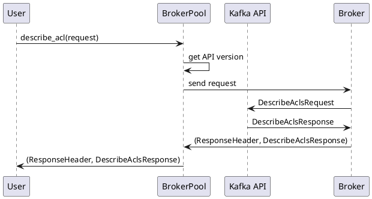

### `create_acl(&mut self, rq: CreateAclsRequest) -> Result<(ResponseHeader, CreateAclsResponse)>`

**Description**: Creates ACLs in Kafka.

**Parameters**:

- `rq`: CreateAclsRequest - Create ACLs request object

**Returns**: `Result\<(ResponseHeader, CreateAclsResponse)>` - Response header and create ACLs response

**Sequence Diagram**:

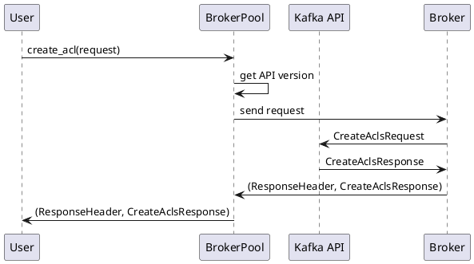

### `delete_acls(&mut self, rq: DeleteAclsRequest) -> Result<(ResponseHeader, DeleteAclsResponse)>`

**Description**: Deletes ACLs in Kafka.

**Parameters**:

- `rq`: DeleteAclsRequest - Delete ACLs request object

**Returns**: `Result<(ResponseHeader, DeleteAclsResponse)>` - Response header and delete ACLs response

**Sequence Diagram**:

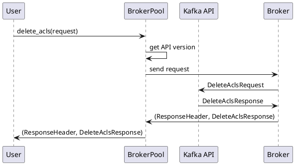

### `list_groups(&mut self) -> Result<Vec<(ResponseHeader, ListGroupsResponse)>>`

**Description**: Lists all consumer groups in the cluster.

**Parameters**: None (self reference)

**Returns**: `Result<Vec<(ResponseHeader, ListGroupsResponse)>>` - Vector of response headers and list groups responses

**Sequence Diagram**:

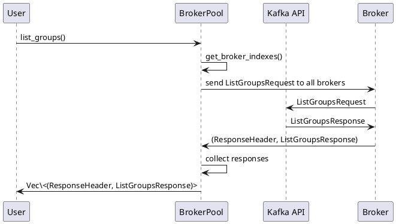

### `describe_groups(&mut self, groups: &[String]) -> Result<Vec<(ResponseHeader, DescribeGroupsResponse)>>`

**Description**: Describes specific consumer groups.

**Parameters**:

- `groups`: &[String] - Slice of group names to describe

**Returns**: `Result<Vec<(ResponseHeader, DescribeGroupsResponse)>>` - Vector of response headers and describe groups responses

**Sequence Diagram**:

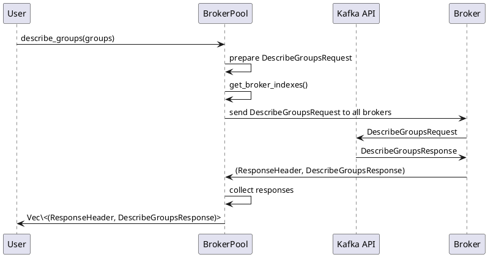

## 2. Configuration Functions

### `KafkaConfig::new(bootstrap: String, protocol: String, verify_certs: bool, cert: Option<String>, key: Option<String>, ca_certs: Option<String>) -> Result<Self>`

**Description**: Creates a new Kafka configuration based on given parameters.

**Parameters**:

- `bootstrap`: String - Bootstrap server addresses
- `protocol`: String - Protocol type ("plaintext" or "ssl")
- `verify_certs`: bool - Whether to verify SSL certificates
- `cert`: Option\<String> - Path to client certificate file (for SSL)
- `key`: Option\<String> - Path to client key file (for SSL)
- `ca_certs`: Option\<String> - Path to CA certificates file (for SSL)

**Returns**: `Result<Self>` - New KafkaConfig instance or error

**Sequence Diagram**:

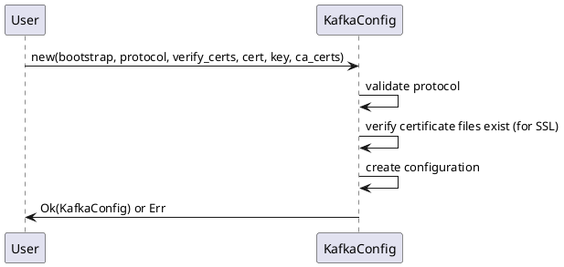

### `KafkaConfig::connect(&self) -> Result<KafkaStream>`

**Description**: Connects to a Kafka broker using the configuration.

**Parameters**: None (self reference)

**Returns**: `Result<KafkaStream>` - KafkaStream connection or error

**Sequence Diagram**:

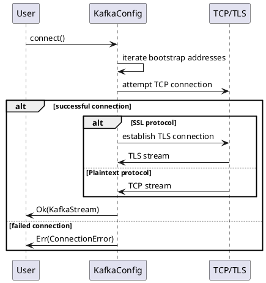

### `KafkaConfig::connect_to_broker(&self, address: SocketAddr) -> Result<KafkaStream>`

**Description**: Connects to a specific broker at the given address.

**Parameters**:

- `address`: SocketAddr - Socket address of the broker

**Returns**: `Result<KafkaStream>` - KafkaStream connection or error

**Sequence Diagram**:

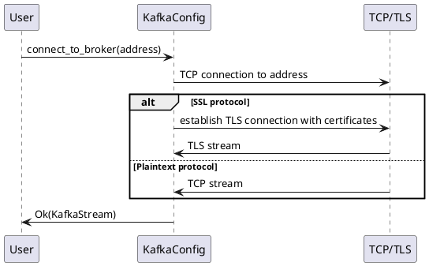

## 3. Utility Functions

### `get_leader_for_topic(&self, topic: &TopicName, partition: i32) -> Result<i32>`

**Description**: Gets the leader broker ID for a specific topic and partition using loaded metadata.

**Parameters**:

- `topic`: &TopicName - Topic name reference
- `partition`: i32 - Partition number

**Returns**: `Result<i32>` - Leader broker ID or error

**Sequence Diagram**:

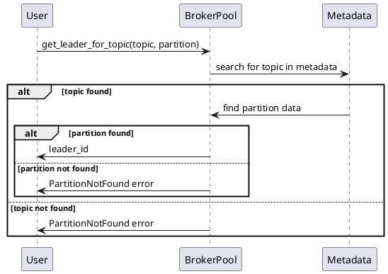

### `refresh_metadata(&mut self) -> Result<()>`

**Description**: Refreshes metadata from Kafka broker.

**Parameters**: None (self reference)

**Returns**: `Result<()>` - Success or error

**Sequence Diagram**:

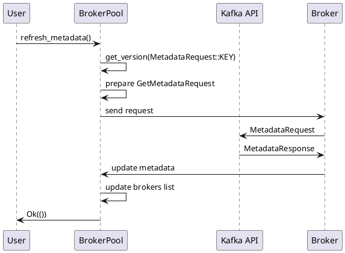
